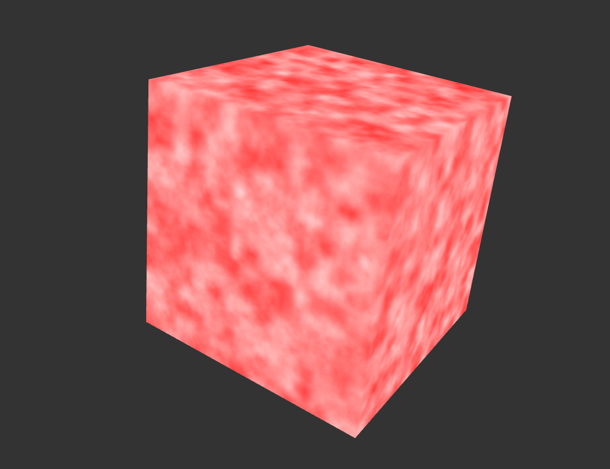

# HW 0: Intro to Javascript and WebGL

  

(Partial result)

## Objective
- Check that the tools and build configuration we will be using for the class works.
- Start learning Typescript and WebGL2
- Practice implementing noise

## Results
Given the base code of the project, I added a cube object that is rendered to the canvas, upgraded the canvas GUI to allow real-time color change of the rendered object through an control panel in the GUI. The fragment shader is updated to use FBM noise function to apply more interesting texture to the object. The vertex shader is updated to include trigonometric deformations to make the object move in some pattern.

## Live Demo
[Install Node.js](https://nodejs.org/en/download/). 
